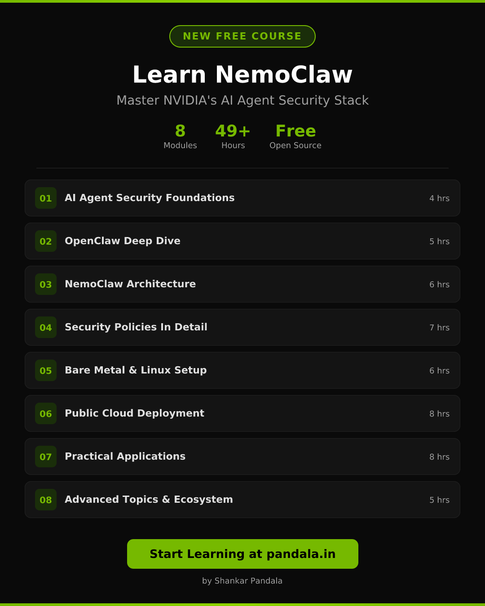

# LinkedIn Carousel Post - Learn NemoClaw

## Image Preview (1080x1350)

## Suggested Post Copy

---

I just launched a **free, open-source course** on NVIDIA NemoClaw - the security stack that makes AI coding agents safe to run.

**What you'll learn:**

- AI Agent Security Foundations
- OpenClaw & NemoClaw Architecture
- Security Policies (network, filesystem, deny-by-default)
- Setup on Bare Metal, Linux, AWS, GCP, Azure
- Practical Applications: CI/CD agents, Telegram bots, multi-agent systems
- Advanced Topics: Local GPU inference with NVIDIA NIM

**8 modules | 49+ hours | 100% free**

Start learning: pandala.in

#NemoClaw #NVIDIA #AIAgents #AISecurity #OpenSource #MachineLearning #AIEngineering #DevOps

---

## Image Details

- **Dimensions:** 1080 x 1350 px (LinkedIn carousel / portrait post)
- **Format:** PNG
- **Generated with:** Satori (JSX to SVG) + resvg (SVG to PNG)
- **Script:** `scripts/generate-linkedin-image.mjs`

To regenerate: `node scripts/generate-linkedin-image.mjs`
